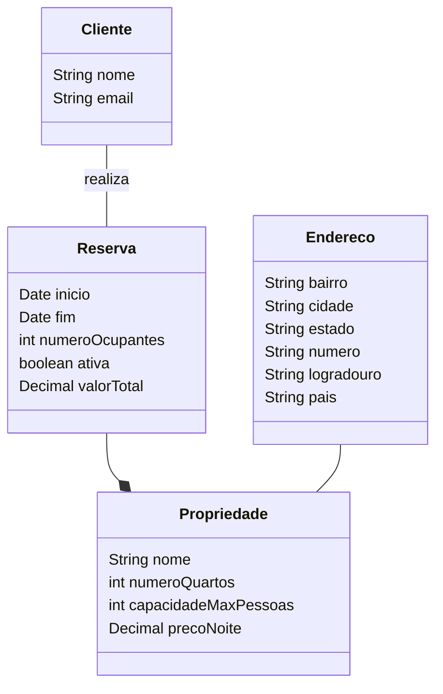

# Diagrama de classes

A fim de mapear as entidades existentes, foi realizado um diagrama de classes simples.

O intuito não é documentar de forma extremamente precisa, mas apenas aglomerar as propriedades identificadas no desafio em um meio de fácil consulta. 

